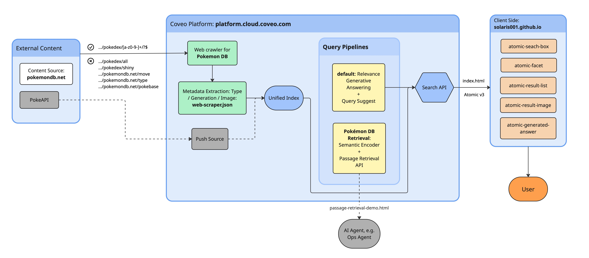

# Laura's Solution for Coveo Pokémon Challenge

> Take-home technical challenge for Coveo's Forward Deployed Engineer (FDE) role: indexing pokemondb.net with the Coveo Cloud Platform and building a custom Atomic search experience.

> **Working note:** 🚩 marks a missing piece of information, 💭 marks a section that was rewritten from a rough/contemplative note (please review it for accuracy).

**Quick links**
- 🌐 Live demo: https://solaris001.github.io/pokemon-challenge/
- 💻 Repository: https://github.com/solaris001/pokemon-challenge 
- - 🗂️ Organization ID: `laurapokemonchallengemcfix5o4`

## Table of contents
- [About this document](#about-this-document)
- [Solution architecture](#solution-architecture)
- [Set-up](#set-up)
- [Essential](#essential)
- [Intermediate](#intermediate)
- [Advanced](#advanced)
- [Bonus: Passage Retrieval API](#bonus-passage-retrieval-api)
- [Backlog](#backlog)

## About this document

While working through the *Pokémon Challenge (Pre-Sales) – 2026* handout, this README documents the implementation steps, 
configuration, and the reasoning behind each technical decision, alongside real-world business analogies for the Pokémon 
Challenge use cases. Since I work agentically with the Claude app and Claude Code, it's important to critically document 
each decision and understand the overall design. This documentation also feeds the presentation content for the challenge 
review, where the structure will be adapted for a live audience.

## Solution Architecture



## Set-Up

I'm on a MacBook and use Homebrew to install Node. The first two Essential-section steps (accepting the Cloud Organization invitation, installing Atomic) are covered once the steps below are done. After the invitation to the Coveo Cloud organization is accepted, install the Coveo CLI and Atomic:

**Organization Name:** `laurapokemonchallengemcfix5o4`

```bash
# Brew handles Node + npm
brew install node

# Install Coveo CLI
npm install -g @coveo/cli

# Install Atomic
npm install @coveo/atomic

# Cleanup: brew uninstall node
```

🚩 **Missing:** this section stops at installing dependencies. Add the steps to actually run the project locally — cloning the repo, and serving `index.html` (documented further down under *Local search page cloud connection* as `npx serve .` on `http://localhost:3000`). Bringing that up here means anyone opening the README can get the demo running from one place, instead of hunting through the Essential section for it.

## Essential

### Index / Crawl pokemondb.net

Task: Index (a.k.a. crawl) pokemondb.net using the Cloud Platform Organization.

**Approaches considered:**
- **Web Crawler**: crawls pokemondb.net on a schedule, indexes the full catalog (~1,028 Pokémon pages)
- **Push API**: a script pushes a small, hand-picked set of records on demand (~5–10 Pokémon)

**Decision: Web Crawler is the primary/production source.**
- The cloud-hosted web crawler is built for exactly this: content that already exists as public web pages. pokemondb.net qualifies directly, since it exposes Pokémon data as public web pages — making the Web Crawler the technically correct choice, not just the simpler one.
- Coveo's Push source is designed for content with *no* native connector and *no* public page to crawl. That condition doesn't hold here.
- Push API is kept as a secondary, parallel pipeline for if the use case extends and Push becomes necessary or adds visible functionality.

**Architecture:** the two sources don't interact during ingestion, they're independent pipelines that happen to feed the same Coveo index. That lets the primary solution ship using the cloud-hosted Web Crawler, while leaving room to "play" with the Push API separately.

**Scope decision:** Push API implementation is deferred for now.
- Building it out would show technical breadth, but wouldn't change what the search experience actually offers the user.
- Time is prioritized on the Bonus tasks instead, since those move the system forward for the user, not just under the hood.

🚩 **Missing:** a fuller Push API business case is found in the
[presentation docs, section 6.](technical-challenge-presentation/TOPIC-1-PRESENTATION.md)

**Current implementation steps:**
- Create a Web source in the Coveo Platform
- Point it at pokemondb.net
- Configure crawl rules to include only individual Pokémon pages (exclude Moves, Types, etc.)
- Extract Type and Generation as custom fields
- Run the crawler

**1. Create a project**
- Type: Corporate website/blog
- Name: `pokemon-atomic`

**2. Create a cloud-hosted Web source**
- Name: Pokemon DB
- Starting URLs:
  - `https://pokemondb.net` — standard root entry point for the web crawler
  - `https://pokemondb.net/pokedex/national` — added because it's the one page that links directly to *every* Pokémon 
  page, guaranteeing complete discovery (Coveo's crawler discovers pages by following links from its starting points)
- Project: `pokemon-atomic`
- Security: Everyone
  - The team is invited for a secure, production-like setup.
  - For the demo, "Everyone" is chosen so the GitHub Pages app can also reach the index.
- Documentation used: https://docs.coveo.com/en/malf0160/index-content/add-a-web-source

**3. Configure the cloud-hosted web crawler**

Crawling rules
- Exclusions:
  - `.../pokedex/all`
  - `.../pokedex/shiny`
  - `.../type`
  - `.../pokebase`
  - `.../move`
- Inclusions:
  - "Include non-excluded pages that match at least one rule."
  - `^https://pokemondb\.net/pokedex/[a-z0-9-]+/?$`

Advanced settings
- No query parameters to ignore — individual Pokédex URLs are clean, no query strings to normalize.
- No directives to override — this isn't a site I own.
- Crawl limit:
  - Number of pages: 3 (need to go three levels "down" to reach `pokemondb.net/pokedex/<pokemon-name>`)
  - Time: default 1000 ms (Coveo only allows a crawl delay below 1000 ms if ownership of the site can be proven via a `coveo-ownership-{orgid}.txt` file at the site root — not possible here, since it isn't my site)

Authentication
- Skipped entirely, because the Pokémon database is a public site.

Content Security
- "Everyone", for the demo — otherwise the app running on GitHub Pages can't reach the index.
  - For a production-like setup, the presentation team has been invited directly instead.

**4. Configure a cloud-hosted web crawler test source**

A single-page Web source (starting URL: `/pokedex/<pokemon-name>`, levels = 0) built to iterate on Type/Generation/image extraction in seconds instead of waiting on the full ~1,000-page crawl. Moltres was chosen specifically for its dual Fire/Flying typing, to confirm the Type selector correctly returns multiple values. Crawling rules and the web scraping config mirror the production source exactly.

#### Results

- 1026 entries indexed at the time of this check, expected 1025:
  - One audit pass showed one stray page, `.../pokedex/national` (a sprite gallery), that should be excluded by the crawler's regex rules.
  - Tracked as an open backlog item (see [Backlog](#backlog)).

### Local search page cloud connection

Task: Connect the local search page to the cloud endpoint to get results when searching.

Creating the API key:
- Coveo Admin Console → Organization → API Keys → Add API Key
- Template: **Anonymous Search** — the right fit here, since this is a client-side Atomic page with no login, querying public Pokémon content. It's tagged "Can be public," meaning it's designed to be safely dropped into browser-side JS like the `initialize()` call — unlike most other templates.
- Name: `Pokemon Challenge - Atomic Search UI`
- Search Hub: `PokemonChallenge`
- Organization ID (given by the platform, used to target the correct endpoint): `laurapokemonchallengemcfix5o4`

Initializing `index.html`:
- Built a minimal `index.html` that loads the Atomic library and theme via CDN, wraps an `atomic-search-box` and `atomic-result-list` inside an `atomic-search-interface` tag, and calls `searchInterface.initialize()` with the access token, organization ID, and `organizationEndpoints` (resolved via `getOrganizationEndpoints()` so the correct region is used automatically), followed by `executeFirstSearch()` to trigger an initial query on load.
- Opening the file directly via `file://` blocks the ES module and fetch calls Atomic needs, due to CORS restrictions — so the page is served locally instead, with `npx serve .` from the project root. This exposes the page at `http://localhost:3000`, where a successful connection shows Pokémon results rendering below the search box on page load.

### Type facet filter

Task: Create a facet to filter search results by Pokémon Type.

In `web-scraper.json`, the following changed: the original config only stripped out boilerplate sections (nav, footer, 
ads) and extracted no metadata, so Pokémon Type had no path into the index. A second config object was added, scoped 
only to individual Pokémon page URLs (excluding the national and shiny list pages), so the extraction never runs on 
non-Pokémon pages. Within that scope, a CSS selector targets the type badges in the page's "Pokédex data" table and 
pulls their text into a new `pokemontype` metadata field. Because that selector matches every badge on the page, Coveo 
automatically captures both values for dual-type Pokémon (e.g. Fire and Flying) rather than just one. That raw metadata 
still needed to be mapped to an actual multi-value facet field in the Admin Console before it could drive the Type filter
on the search page. 

For sake of focus and transparency the `web-scraper.json` file was created and the content from the JSON file on the
platform was copied here. The `web-scraping.json` file in this reposirtory is therefore not used by the system, it is just 
a copy of the file directly connected to the platform on the platform. 

On the Coveo Platform, under **Fields**, a field `pokemontype` was added:
- String
- Multi-value facet

Then, under **Sources**:
- Choose Pokemon DB Test
- Click **More → View and map metadata**
- Search for `pokemontype` and click on it
- Click **Add to index**
- Field: `pokemontype`

Interesting observation: Pokémon DB shows the normal and the Galarian form as two panel tabs on the same page. Reading the type through `table.vitals-table a.type-icon::text` returned the types for *both* forms (e.g. Moltres: Fire, Flying **and** Galarian Moltres: Dark, Flying). Scoping the selector to `.sv-tabs-panel.active table.vitals-table a.type-icon::text` fixed it — the type is now only returned for the active (displayed) tab, not the second one.

The Type facet uses Coveo's default `resultsMustMatch: atLeastOneValue` behavior: selecting multiple values (e.g., Dark 
and Ghost) returns Pokémon matching *any* selected type, not all of them. This default was kept deliberately, even though
Type is unusual among the facets here in being multi-valued, because it preserves the checkbox-filter mental model users
already bring from virtually every e-commerce and enterprise search UI. More selections broaden results, they don't 
narrow them. Switching to an "all values must match" mode was considered, to support exact dual-type lookups (e.g., 
"show me Dark/Ghost types"), which is a real and common query in the Pokémon domain specifically. It was rejected as the
default, since it inverts the standard convention and effectively caps out at two selections before guaranteeing zero 
results, a behavior most users wouldn't expect from a checkbox filter without explicit UI signaling. A dedicated dual-type
search remains a viable enhancement, but as an explicitly separate, opt-in mode rather than a change to default facet 
semantics.

### Generation facet filter

Task: Create a facet to filter search results by Pokémon Generation.

🚩 **Missing:** this section currently just says "similarly to the previous set-up." At minimum, mirror the Type facet write-up above: which CSS/XPath selector extracts the generation, whether it needed the same `.active`-tab scoping fix, whether `pokemongeneration` is single- or multi-value, and the field-mapping steps if they differ from Type at all.

### Display Pokémon picture

Task: Display the Pokémon's picture directly in their search result.

The `pokemonimage` entry was added into the same metadata object as `pokemontype` and `pokemongeneration`, in the web scraping JSON file.

🚩 **Missing:** this is noticeably thinner than the Type/Generation write-ups. Worth adding: which CSS selector pulls the image URL, how the field is mapped in the Admin Console, and which Atomic component renders it in the result template (e.g. `atomic-result-image`) — especially since the [Backlog](#backlog) already flags a missing-image fallback issue for this exact field.

## Intermediate

### Host code on GitHub & host search app

The Pokémon search app is hosted as a static site on GitHub Pages, which serves the committed `index.html` directly from
the repository with no separate build or server step required. The Coveo Search API key embedded in `index.html` uses the
Anonymous Search template, which Coveo explicitly designates as safe for public client-side use. Its only privilege is 
`EXECUTE_QUERY` (running searches) plus analytics write access: it cannot modify, delete, or administer any content, 
source, or configuration in the organization. Because the key can only do what any anonymous visitor to the public 
search page is already allowed to do, committing it to a public GitHub repository introduces no meaningful security risk.
This is the standard pattern Coveo recommends for any Atomic search page that runs entirely in the browser without a backend.

The Pokémon search page is hosted on GitHub Pages here: https://solaris001.github.io/pokemon-challenge/

## Advanced

### Deploy Coveo RGA

Task: Deploy Coveo RGA to get a generative experience.

#### Configure the RGA model on the platform

- Learn from, Sources: Pokemon DB (WEB2)
- Filter: left empty, since the source only contains indexed Pokémon pages
- Associated with the query pipeline:
  - Model: Pokémon RGA Model
  - Condition: Query is not empty
  - Items to consider: 100
  - Chunk relevancy threshold: Medium
  - Rich text formatting in generated answers: On
  - Thesaurus rules: Off

A **condition** in a Coveo query pipeline is a boolean rule evaluated against each incoming query, determining whether a
specific pipeline component, here, the RGA model association, gets applied to that query. `Query is not empty` was used
because it's the condition Coveo requires for any RGA model association: RGA generates its answer from the text of the 
user's query, so on an empty query (e.g. page load, before the user types anything) there's nothing to embed or retrieve
against, and the model should simply stay inactive.

**Items to consider (100)**: RGA retrieval happens in two stages. First, a normal Coveo search runs and returns the 
top-matching Pokémon pages. "Items to consider" caps how many of those top results get passed into the second stage, 
where the model pulls out the actual text chunks used to write the answer. 100 is generous headroom for a ~1,028-item 
index, it just means "look at up to the 100 most relevant Pokémon pages before picking passages." This would only be 
shrunk with a finely-tuned pipeline, to force the model to ignore lower-ranked results.

**Chunk relevancy threshold (Medium)**: once those top items are in play, each text chunk inside them gets scored for 
semantic similarity to the query. The threshold is how picky the model is about what counts as "relevant enough" to 
actually use. Too high, and vague or unusual queries won't generate an answer at all (not enough chunks clear the bar). 
Too low, and it'll happily generate answers from marginally-related text. Medium is the balanced default, fine to leave 
as-is unless answers fail to generate for queries that clearly should work.

**Rich text formatting (on)**: controls whether the generated answer renders with actual formatting (bold, lists, 
headings, tables) or as flat plain text. Since Atomic (not Headless) is in use here, it picks this up automatically, 
no extra config needed for it to render correctly. Left on; it's just a nicer-looking answer for the same content.

**Thesaurus rules (off)**: only matters if the pipeline has synonym rules defined; otherwise there's nothing for the toggle to use. Its job is bridging vocabulary gaps, like mapping "flying-type" to "Flying" if users phrase things differently than the indexed content. Since Pokémon names, types, and generations already match how users search, there's no gap to bridge, so it's left off.

**Query parameters**: On default pipeline in Advanced tab, we configure Query parameters and add query parameter rule: 
- Partial match: 
  - In a query: 5
  - In a result: Absolute number, 1

#### Wiring the search page to the model

- Atomic component added to `index.html` 
  - `atomic-generated-answer`
  - sits right in search box
  - no further configuration added
  
### Query suggest

Task: Preload a Query Suggest model to get type-ahead.

Query Suggest is Coveo's autocomplete. It plugs directly into the search box in Atomic 
(`atomic-search-box-query-suggestions`). Query Suggest learns from usage analytics, real queries people typed and results
they clicked. A brand-new model has no history yet, so it would show an empty dropdown. That's exactly why the model is 
preloaded with a Default Queries file: a CSV list of expected search terms (Pokémon names, types, etc.) written by hand. 
That way type-ahead works immediately in the demo instead of waiting for organic usage data to build up.

**Why it's worth doing**: it reduces typos and false starts, nudges users toward queries that actually return good results, and it's a small but very visible "polish" moment in a live panel demo that shows production-thinking.

**Business use case**: a software company's customer support portal gets thousands of tickets full of inconsistent, 
often-misspelled bug descriptions. By preloading a Query Suggest model with a Default Queries file built from the 
product's real feature names and error codes, agents and customers see accurate suggestions like 
"certificate expired error" instantly when they start typing well before enough organic click data exists to train the 
model naturally. That gets people to the right knowledge-base article faster, cutting both average resolution time and 
the number of tickets filed simply because search returned nothing useful.

#### Implementation

On the platform, in the Admin Console:
- Models → Add model → Query suggestion
- Data period: 3 months, Building frequency: Weekly (default, recommended)
- No filters applied
- Name: Pokémon Query Suggest Model
- Project: `pokemon-atomic`
- Model ID: `laurapokemonchallengemcfix5o4_querysuggest_2bdd1635_c992_41ee_9036_267279fa0872`

Once the model is built, it's associated with a query pipeline:
- Pick the default pipeline → Edit component
- Machine Learning tab → click Associate model
- Model: Pokémon Query Suggest Model
- No condition set (query suggestions are meant to fire on any partial input, so unlike RGA's mandatory "Query is not empty" condition, there's no equivalent restriction needed here)
- Preloaded query sheet, with weights: `merged-default-queries.csv`

A new API key is also created, because this upload needs a key with the "Machine Learning Model configuration files — Edit" privilege, not the public Anonymous Search key sitting in `index.html`. This one is never exposed client-side; it's only used once, from the terminal.
- Name: `Pokemon Challenge - QS Model Config (Admin, Temp)`
- Privileges: Machine Learning → Models → Access Level: Edit
- **Must remain private.**

The integration itself is a direct API call to the platform:

```bash
curl -X PUT \
  "https://platform.cloud.coveo.com/rest/organizations/laurapokemonchallengemcfix5o4/machinelearning/models/laurapokemonchallengemcfix5o4_querysuggest_2bdd1635_c992_41ee_9036_267279fa0872/configs/DEFAULT_QUERIES?languageCode=en" \
  -H "Authorization: Bearer PUT_API_KEY_HERE" \
  -F "configFile=@merged-default-queries.csv" \
  -i

# Verify it actually landed, by downloading it back
curl -X GET \
  "https://platform.cloud.coveo.com/rest/organizations/laurapokemonchallengemcfix5o4/machinelearning/models/laurapokemonchallengemcfix5o4_querysuggest_2bdd1635_c992_41ee_9036_267279fa0872/configs/DEFAULT_QUERIES?languageCode=en" \
  -H "Authorization: Bearer PUT_API_KEY_HERE"
```

### Pokémon Detail Page

Task: Add a Pokémon Detail Page to show the details of a single Pokémon.

**Business case analogy**: a job search site, like Indeed. Indeed doesn't write job postings itself, it crawls them from thousands of different company career pages. Right now, without a detail page, clicking a job in Indeed's search results would just send you to that company's own website (different layout every time, sometimes broken, sometimes ugly). Indeed instead built its own detail page: same data, but styled consistently, kept inside Indeed, with an "Apply" button Indeed controls.

#### Implementation

`clickableUri`: `https://pokemondb.net/pokedex/moltres`

- Created a new HTML page: `pokemon.html`
- Uses Headless for that. 🚩 **Missing:** why Headless rather than Atomic here, given the rest of the app uses Atomic,
this is exactly the kind of architecture choice Topic 1 asks candidates to justify, so it's worth a real paragraph, not a placeholder.
- Test the single Pokémon detail page with: `localhost:3000/pokemon?name=moltres` (any other Pokémon slug also works)

## Bonus: Passage Retrieval API

Task: "You've done everything above and feel like there's more you can do? Build something interesting on top of the 
Coveo Passage Retrieval API! At a minimum, you should understand the Passage Retrieval API and have a point of view on how you would use it in future use cases." Also: "Please email us with the OrgID so that the Passage Retrieval can be enabled."

Note on the email step: Passage Retrieval appears to already be enabled on this organization, so building started directly rather than waiting on that step.

**What Passage Retrieval does**: it takes a natural-language query and, instead of returning whole documents (like normal
search) or a synthesized answer (like RGA), returns a ranked list of small text passages, chunks pulled out of the indexed
items, each with a relevance score and a pointer back to its source document. It's a two-stage process under the hood: a
Semantic Encoder model finds the most relevant items first (meaning-based, not just keyword match), then the CPR model 
zooms into those items and extracts the specific passages that actually answer the query. So for "Compare the height and 
weight of Charizard and Blastoise," it wouldn't hand back a written comparison, it would return, for example, a passage 
from Charizard's page stating its height/weight, and a passage from Blastoise's page doing the same, each scored and each
traceable to its source page. What happens with those passages next, synthesizing them into an answer, feeding them to an
LLM, displaying them raw, is entirely up to whatever's calling the API.

### Implementation

- Add model → Semantic Encoder.
  - Name: Pokemon DB Semantic Encoder
  - Why? The Semantic Encoder does the vector-based, meaning-based first-stage retrieval that narrows the index down to 
  the most relevant items before CPR ever runs. Coveo requires both models together because CPR (Coveo Passage Retrieval)
  only extracts passages from whatever the Semantic Encoder has already identified as relevant, so without it there's no 
  candidate set for CPR to pull passages from.
  - Project: `pokemon-atomic`
  - Associated Query Pipeline: Pokémon DB Retrieval Demo
  - Condition: Query is not empty (the model only produces something meaningful when there's an actual query to encode)

- Add model → Passage Retrieval
  - Name: Pokemon DB Passage Retrieval
  - Project: `pokemon-atomic`
  - Associated Query Pipeline: Pokémon DB Retrieval Demo
    - Condition: Query is not empty (same reasoning, nothing to retrieve passages for on an empty query)

**A new, dedicated query pipeline was created for this model** rather than reusing the existing one:

- Add a query pipeline
  - Name: Pokémon DB Retrieval Demo
  - Project: `pokemon-atomic`
  - Condition: None, because a pipeline with no condition is never picked up by Coveo's automatic routing (condition-less 
  pipelines are skipped when matching incoming queries to a pipeline). It only gets used when something explicitly names 
  it, which is exactly what the demo file does, via the `pipeline` field in the request body. That's the ideal setup for 
  a dedicated demo pipeline: fully isolated, and it can never accidentally intercept traffic from the main search page or
  the RGA pipeline, since nothing routes to it except an explicit call by name.
  - Interface URL: None, because the Interface URL field is for search-interface-enforced routing: it makes any page hosted
  at that URL automatically use this pipeline, regardless of condition. That's a third routing mechanism (Interface URL 
  takes precedence over condition, per Coveo's routing precedence), and it doesn't apply here for the same reason the 
  condition doesn't, there's no search page hosted anywhere that should route to this pipeline. `index.html` should keep
  going to whichever pipeline RGA is on, not this one.

**Important implementation note:** for a fast, working demo of this feature, the "Moves learned" section is excluded. 
That data could genuinely be useful for other query types not yet tried (e.g. "what TMs can Blastoise learn"). If CPR 
needs to answer those well too, excluding the section entirely trades one kind of quality for another rather than 
fixing it outright, the real production answer would be routing different content types to different fields or even 
different sources, rather than deleting them. 

### Demo / Test

Once the repository is cloned and the system is set up locally, this component can be tested at: `http://localhost:3000/passage-retrieval-demo.html`

## Backlog

- `/pokedex/national` and the "List of Pokémon" sprite gallery) is still being indexed and should be exclude (needs a 
re-crawl to confirm the `ExpandBeforeFiltering` fix actually took. 
- Type facet returns 110 Flying-type Pokémon, while officially there are 134.
- Understand, and be ready to explain, the system architecture and technology behind the RGA model.
- Optimize the listing so that Pokémon matching two selected types (perfect matches) are ranked first.
- One Pokemon image not depicted: Tatsugiri

